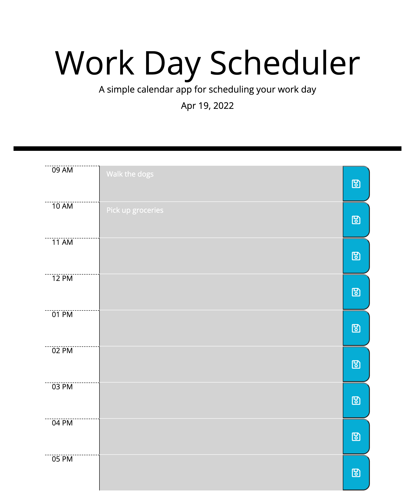

# Zito-Work-Day-Scheduler

Deployed site: https://haleyhilton.github.io/Zito-Work-Day-Scheduler/

This work day scheduler should function to help an employee (or anyone) manage their busy schedule. Key functionality of this scheduler is as follows:

-moment() updates date daily, backend option to add time
-input text and events under the time block you plan to execute
-save will both save the text and persist in localStorage after refreshing the page (should it need to be referenced)
-timeblocks will change color depending on event due time: past, present and future to ensure urgency

At the end of your day, you can expect your scheduler to look like the below

